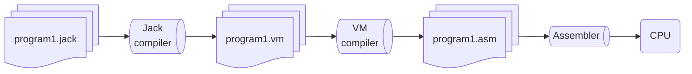

The <a href="https://www.nand2tetris.org">Nand2Tetris</a> course is designed by <a href="http://www.cs.huji.ac.il/~noam/">Prof. Noam Nisan</a> and <a href="http://www.shimonschocken.com/">Prof. Shimon Schocken</a>.
You can check out the <a href="https://www.ted.com/talks/shimon_schocken_the_self_organizing_computer_course"> TED Talk </a>/<a href="https://youtu.be/iE7YRHxwoDs?si=NvbkWKCvghOK96UF"> YouTube </a> by Prof. Shimon Schocken for the motivation behind designing this course.

## Development of the simulated hardware
The course begins by assuming the NAND gate is given and proceeds to construct digital circuits using it.
We develop the ALU and combine it with memory and registers using buses to build simulated hardware.

    

        
    

    

        
    

    

        
    

    First, we construct various gates using NAND gates and then build the ALU using these gates. Using data flip-flops, we make the memory unit (RAM). Connecting all the components, along with some registers made using flip-flops, completes the CPU. The CPU is connected to the display and keyboard as per the design.

Once we integrate the components built using NAND gates with the memory units built using flip-flops, we have a functioning CPU.
We can now run assembly language programs on our computer.
We also write an assembler that compiles the assembly language code into machine-level language. 

## Making a software layer

Writing assembly language code is cumbersome.
We need a way to write code which are easy to manage.
Here, we develop a language called Jack, an object-oriented language.
The task of compiling this high-level language is divided into two parts to simplify the compiler design.
First, we compile the program written in the Jack language to an intermediate language that can run on a stack machine.
The code in intermediate language is further compiled to assembly language with another compiler.

You can find the complete implementation at GitHub: <a href="https://github.com/JayeshMD/Nand2Tetris">JayeshMD/Nand2Tetris</a>.
When the computer starts, the number of variables gets initialized.
The following image shows the output on the display once the computer starts.

    

        
    

    Computer rebooted successfully!! You can see video of pong game on <a href="https://youtu.be/VhFACTPVjW8?si=gWPZZ715IG1CVOeG">youtube</a>.

I also implemented the game <a href="https://youtu.be/DfiADVICySQ?si=up4peyONCCYSEE7R">Fix It</a> game on this computer.  

    

        
    

    We can now run the game on our computer. Check out the Fix It game at <a href="https://youtu.be/DfiADVICySQ?si=up4peyONCCYSEE7R"> YouTube </a>.

 

Until now, we have used the hardware simulator and virtual machine emulator to run JACK OS and games.
I also worked on implementing the hardware on an FPGA (Field-Programmable Gate Array).

## Implementing CPU architecture on FPGA

I used the Basys 3 development board by Xilinx.
The board has an Artix 7 FPGA.
The board features a USB port and a VGA port for connecting a keyboard and a monitor.
Although we can establish these connections, we need to implement the CPU along with a driver for communication with the keyboard and display.

    

        
    

    The Basys 3 board is used for implementing CPU hardware.

 

The major challenge was to develop a driver to map memory to display using the VGA protocol and another driver to access keyboard input.
This mapping was not a significant concern in the Nand2Tetris course, as the simulator readily provides the mapping of the display and keyboard to memory.
To achieve this need, I implemented a raster scan display at 60 Hz on hardware using the Verilog language.

    

        
    

    Playing a game on CPU implemented on FPGA. Checkout video on <a href="https://youtu.be/c2e3QnLzx_o?si=6UuJYE6vK3_DKgwv">youtube</a>. 

 

If you find this interesting, you can check out the <a href="https://www.nand2tetris.org">Nand2Tetris</a> course.
If you get stuck somewhere in the course, you can check out my repository <a href="https://github.com/JayeshMD/Nand2Tetris">Nand2Tetris</a>.
If you want to get an idea of FPGA-based implementation, you can visit <a href="https://github.com/JayeshMD/Nand2Tetris-FPGA">Nand2Tetris-FPGA</a>.